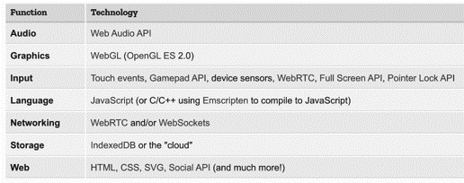
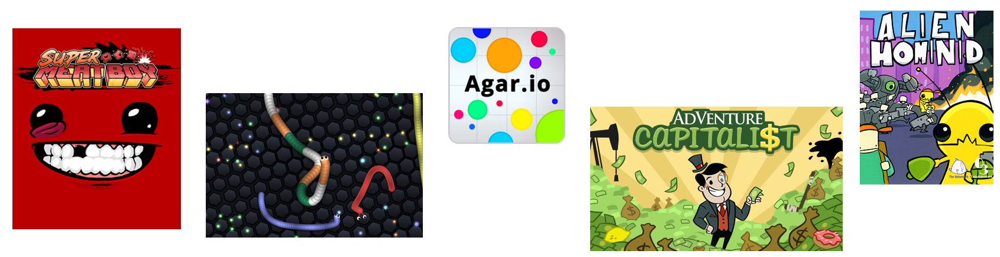

<!-- _class: main -->

# Web Games
## Week 1: Module Introduction

<!--
Welcome to Web Games!
-->

---

# Objectives

- Introduce the module aims and content
- Gain an insight into the web games market
- Understand game audiences
- Play some games!

<!--
In today's session we will...
-->

---

<!-- 
_class: lead
-->

# 1. Module Introduction

---

# Web Games

This module aims to introduce the key design decisions and technical methods behind making games for the web.

You will explore creative ideas that differentiate themselves from large scale games typically deployed to desktop or console markets. Your focus should be on creating games that are easy to pick up, casual in nature, yet still have an addictive replay value and social shareability.

<!--
In this module we are interest more in games that align with a casual audience, that can be picked up and put down easily, yet should still be addictive in nature and encourage replay.

These are the types of games popular in mobile markets that you see people filling their time with on their commute to work, but still hook the players in as they seek to gain achievements and get to the top of leaderboards

We are using tools that do not require “technical proficiency” in Javascript, thus your work is assessed on the creativity as much as the technical implementation. I want to see ideas that spark joy when I play them I don’t require a 50 hour game play that you might get with a console title. 

[SHOW SCHEDULE]
-->

---

# Module Assessments

 

**S1: Contextualising Statement (20%)**

 

**S2: Playable Prototype (80%)**

<!--
This module has two assessments

1. Contextualising Statement which is worth 20%
2. Playable Prototype which is worth 80%
-->

---

# S1: Contextualising Statement
A 1,000 - 1,500 word written statement that contextualises your proposed web games prototype project against the wider web games market

**Deadline: 7th Novemeber**

<!--
The first assessment is the contextualising statement, which is a written report that demonstrates your critical understanding of the current web games market, including an analysis of existing games. This leads into the proposal for the game you intend to produce for the end of the module.
-->
---

<!-- _class: threes -->

# S1 - Content

## Introduction
An overview of the current web games market.

## Summary of  Artefacts
A review of existing web games relevant to your prototype proposal that have been used as inspiration.

## Prototype Proposal
A discussion of your proposed prototype project. Including concept, key gameplay mechanics, unique selling point, target audience and why it is suitable as a web game. 

<!-- 
The conextualising statement should include include the following key sections

[OVERVIEW]

For full information please refer to the brief on Minerva
-->
---

# S1 - Marking Criteria

- Structure (20%)
- Market & Existing Artefact Analysis (40%)
- Playable Prototype Proposal (40%)

<!-- 
The conextualising statement is marked against the following criteria

[EXPLAIN]

-->
---

# S2 - Playable Prototype

A completed web game prototype, with supporting documentation (written & video) that summarises planning, development, testing and potential routes to market. 

**Deadline: 14th January**

<!-- 
The playable protoype assessment is a completed web game that addresses the aims of the module. This game is accompanyied by supporting documentation that includes written and video components. 
-->

---

# S2 - Requirements

The genre and concept of your game is up to you but your focus should be on creating games that are easy to pick up, casual in nature, yet still have an addictive replay value and social shareability. 

The features you implement are up to you. However, you may wish to consider features that enhance shareability and create avenues for monetisation. Additionally you should aim to publicly publish your game to gather wider feedback and testimonials for your game.

---

<!-- _class: twos -->

# S2  - Supporting Documentation

## Development Document

- Title
- Abstract
- Pre-production Materials
- Technical Description
- User Testing & Feedback
- Critical Reflection

## Walkthrough Video

A short video to serve as a professional showcase of your game. The video must demonstrate a full playthrough of the core gameplay loop, from the start screen to a clear end state (win or loss). 

<!--
Your prototype should be accompanied by supporting documentation which includes a written development document and a walkthrough video

The development document should consist of...[Explain each element]

A short video to serve as a professional showcase of your game. The video must demonstrate a full playthrough of the core gameplay loop, from the start screen to a clear end state (win or loss). The recording should have clear audio and visuals to effectively present your work. While commentary is not required, you may include it to highlight specific game mechanics or design choices.

The written development document should not exceed 2,000 words

[EXPLAIN]
-->

---

# S2 - Marking Criteria

- Concept (10%)
- Design & User Experience (25%)
- Technical Implementation (40%)
- Documentation (25%)
<!--
The playable prototype is assessed on the following criteria

[EXPLAIN]
-->

---

# S2 - Example Projects

You can find a selection of example playable prototype developed by students in previous iterations of the module within the Playable Prototype assessment folder on minerva.

<!--
[Show where these are located on Minerva]
-->

---

<!-- _class: question -->

# Questions?

## Menti: xxxx-xxxx

---

<!-- _class: lead -->

# 2. Web Games Market

---

# HTML5 as a Game Platform

Web games are video games that can be played in the browser. Whilst previously these might need plug-ins to run, advances in the performance of Javascript and Web APIs means we can create highly creative, powerful and sophisticated games with standard web technologies that work across browsers and devices. 

<!--
Advances in web technologies have enabled the production of high quality and easily accessible games that run within the browser and across devices. Through the module we will explore the usage of these tools via game making engines for the web. 

-->

--- 

# Why use web tools?

- Audience Reach
- Marketing & Discoverability
- Control over revenue
- Improved Analytics
- Direct customer relationships
- Accessibility 
<!--
Audience Reach - The reach of the web is enormous. Think of how many people have access to the internet across various devices. As soon as you go to a specific platform (e.g. console, ios, android) you begin limiting your audience. Yet games built with HTML5 work across devices, in your standard browsers, on mobile, tablets, and smart tvs as well as being able to be ported to console in certain instances

Marketing and Discoverability - By delivering via the web you can improve the marketing and discoverability of your product. You are not limited by the promotion mechanics of other platforms. Instead you can make you game easily accessible across platforms taking advantage of the webs inherent linkability and shareability to drive audience reach

Control over revenue - using the web as a distribution platform means you have greater control over how you can earn revenue. Typically app stores require you to pay 30% of revenue paid and are locked into their revenue systems. On the web you can keep a greater percentage and use monetisation mechanisms best for your needs

Seamless updates - you can easily make updates, improvements and add features to your game without needing to go through a third-party for approval. Instead critical fixes can be made instantly

Improved Analytics - again the control you have means you are not restricted by what analytics tools you use to gain insight into how your games are performing. This can give you deeper and more useful insight.

Direct customer relationships - Feedback is not filtered through third-party review platforms that can make interacting and responding to your audience cumbersome. Instead you can control how these relationships are managed

Accessibility - Web games can be played anywhere. Meaning players can pick up and play no matter where they might be and what device they might have with them.
-->

---

<!--
Source: Newzoo Global Games Market Report 2023
https://newzoo.com/resources/trend-reports/newzoo-global-games-market-report-2023-free-version

An updated report actually removes the Browser game slice which is now encompassed within PC games, accounting for an increase in this area
https://newzoo.com/resources/blog/global-games-market-revenue-estimates-and-forecasts-in-2024
-->

---

# Growth of emerging markets
- Games playable on social sites are increasing in popularity
- Facebook, SnapChat, TikTok and WeChat all have games
- Facebook Instant Games accrues over 700 million monthly plays
- Youtube are experiementing with ‘playables’
- The lack of device and network constraints provide access to emerging markets with high growth potential

<!--
Social media platforms are emerging as sites for web games distribution and demonstrating strong potential including Facebook Instant Games and other social sites such as WeChat, Snapchat and TikTok

These platforms and the accessibility of the web in general is not constrained by device type create high potential to access emerging markets. For example India alone will generate over $1.5 billion in games revenue. Facebook and Google are actively developing tools and publishing platforms to target these markets. For example Facebook Lite a streamlined version of the app for those with limited connections can run instant games and Googles GameSnacks seeks to make HTML5 games lightweight so they can be easily run in emerging markets with low network conditions.

More recently Google has launched playables on Youtube - mini games you can play directly in the app. This follows similar moves by the New York Times and LinkedIn (yes LinkedIn!)

FRVR is one company that has utilised Facebook Instant Games to success generating 7 figure ad revenue for its Basketball title

Sources: 
https://www.blog.google/technology/area-120/gamesnacks-brings-quick-casual-games-any-device/
https://www.gamedeveloper.com/business/report-google-is-experimenting-with-instant-games-on-youtube
https://developers.facebook.com/success-stories/frvr/
-->

---

<!-- _class: question -->

# Why are sites like Youtube and LinkedIn introducing games?

## Menti: xxxx-xxxx

<!--
- Engagement
- Monetisation
- Retention
-->

---

<!-- _class: threes -->

# Web & Mobible Games

## $92bn+
Estimated revenue for mobile games in 2023

## 1 in 2
Mobile app users have opened a game app in the last seven days

## 3rd most popular
Games are the third most popular app category on mobile. Only beaten by social media and shopping, and equal with music. 

<!--
As we’ve seen web games can be played across devices and the games you create in this module can target not only desktop gamers but also mobile gamers either directly through the browser or via app store markets. This dramatically increases the audience and revenue potential. 

The crucial benefit is that with the tools we will learn during the module we can create these games and use a single codebase that is instantly ready to be deployed to multiple platforms and access these markets. 

Thus whilst this module is called “Web Games” the games that we are seeking to create are those that can target both casual web and mobile game players and tap into this massive market potential.

Source: Newzoo Betting on Billions
-->

---

# Web Games History

- Web games are not new
- Early web games were first launched  in 1996
- Through 2000s Flash powered a web games boom
- Flash gaming site miniclip was once valued at £900 million

<!--
Web games are not a new thing and have been played in browsers since plugins suchs as shockwave and flash made it possible. In the early to mid 2000s there was a boom in flash games online, with the flash plugin installed on 99percent of computers.

At the peak of flash gaming popular sites such as MiniClip garnering millions of play sessions and ad revenue which in many cases was passed onto developers through revenue shares. 

However due to security issues and the Apple ban of Flash content working on its mobile devices we saw a slow decline in flash content and the popularity of flash games as people switched to mobile. Yet as noted with the advances of HTML5 much of this flash content is now being replaced by HTML5 games with publishers such as Miniclip, Kongregate and Pixi accepting HTML5 games from developers and successfully drawing in players and revenue for this content. 

https://www.gameinformer.com/2018/12/22/how-flash-games-changed-video-game-history

-->

---

# Web as a test bed

The web can be an excellent testing ground for prototyping game ideas and generating an initial audience before porting to other platforms after proving its popularity.

<!--
Super Meat Boy originated as a flash game in 2008

Adventure capitalist originated as a browser / android game in 2014 and has since launched on console and steam

Agar.io originated as an HTML browser based games before being purchased by MiniClip and ported to iOS and Android

Slither.io which was inspired by Agar.io similar found viral success and was ported to iOS and Android

Alien Hominid started as a flash game and subsequently launched on Xbox, playstation and mobile

For an overview of how web tools (specifically Flash in this instance) has shaped the Games industry see this GDC conference talk: https://www.youtube.com/watch?time_continue=1&v=65crLKNQR0E&feature=emb_title
-->

---

<!--
Source: Newzoo Global Games Market Report 2023
https://newzoo.com/resources/trend-reports/newzoo-global-games-market-report-2023-free-version
-->
---
<!-- _class: question -->

# What made Wordle successful?

## Menti: xxxx xxxx

---
<!-- _class: break -->

# Break

---

<!-- 
_class: lead
-->

# 3. Game Audiences

---

<!-- _class: question -->

# Who Plays Games?

## Menti - xxxx xxxx

---

<!--
https://newzoo.com/resources/blog/overview-newzoos-gamer-segmentation-and-gamer-personas

Who do you think is the biggest segment? [TIME]

https://newzoo.com/resources/blog/the-mainstream-gamer-persona-accounts-for-23-of-the-worlds-3-2-bn-gamers

-->

---

<!-- _class: question -->

# How does angry birds appeal to different personas?

## Menti: xxxx xxxx

<!-- 
Use the whiteboard to answer this question

https://www.siliconrepublic.com/gear/why-gamers-flock-to-angry-birds-infographic

https://www.wired.co.uk/article/how-rovio-made-angry-birds-a-winner
-->
---

<!-- 
_class: lead
-->

# 4. Play Session

---

# Critical Review

##
Play the games linked in the week 1 materials on Ultra and consider the following factors

- Engagement
- Design & Usability
- Creativity
- Areas for improvement

Use the worksheet on Ultra to keep a record of your evaluations

---

<!-- _class: question -->

# Which game was your favourite?

## Menti: xxxx xxxx
---

# Task for next week

Over the next week play some existing to gain inspiration and further develop ideas for what you may wish to develop during the module.

From this review pick one game you particularly enjoyed to write a review using the framework introduced in the last task.

You should add your review and a link to the game to the discussions thread on Ultra before next week's session.

---
<!-- _class: main -->

# Up Next...
## Web Game Design Principles

<a style="text-decoration: underline; position: absolute; bottom: 40px; font-size: 20px; color: #272838;" href="https://www.flaticon.com" target="_blank" title="cloud service icons">Icons sourced from Flaticon</a>

<!--
Next week...
-->