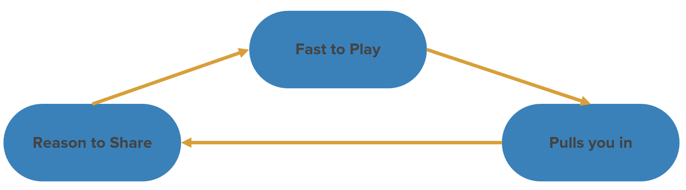

<!-- _class: main -->

# Web Games
## Week 2: Design Principles

<!--
Welcome to week 2
-->

---

# Objectives

- Understand the principles of web game design
- Play more games!
- Discuss games where these principles are present

<!--
In today's session we will...
-->

---

<!-- _class: lead -->

# 1. Design Principles

---

# Easy to pick up

- Web games should be easy to pick up and play
- Players will make decisions on whether to continue playing very quickly
- Don’t bury the player under a mass of instructions 
- Consider the context of use

<!--
Web games (at least in the context we are studying them here) should be easy to pick up and play, allowing the player to get into the action quickly

Like many things on the web your players will make decisions on whether to continue playing very quickly. They have an abundance of other things vying for their attention, so you need to hook them in quickly

Like most games, don't bury the players under a mass of instructions. This goes back to the first princple of making it easy to pick up and play. If their is an element of mastery needed guide them towards this gradually

Make sure you are considering the context of use. The games we are seeking to develop here might often be considered 'time filler' activities. Players are likely playing on mobile, they might have other distractions and just dropping in and out. These factors need consideration
-->

---

# Hard to put down

- Make your game hard to put down
- Easy to pick up does not equal easy to play
- Consider gamification features to enhance replay value
    - Highscores, achievements, social integrations
    - Hidden content, Levels, In game store or extra content

<!--
Whilst your games should be easy to pick up they should also be hard to put down. Remember easy to pick up does not neccesarily mean easy to play. Take flappy bird as an example. The game was incredibly easy to pick up and begin playing with only a single control mechanism - yet the physics of the bird and navigation between pipes made it difficult to master and achieve a high score. 

This balance between ease and challenge is one way to make your games hard to put down and in part this also comes in the form of short play sessions. Taking Flappy Bird as an example again, which their was a frustrating difficulty, the short play sessions encouraged players to keep going - an enticement of dopium... "This next run will be the best one" keeps players hooked

Other ways to make games hard to put down is gamification features. Highscores and achievements are key ones that keep players coming back as they strive to be the best and complete all parts of the game. 
-->

---

# Shareable

- Make people want to share your game by making it
    - Enjoyable
    - Desirable
    - Accessible
- Enhancing shareability can increase audience reach and monetisation

<!--
Enjoyable - easier said than done but make the game fun and enjoyable to play. People talk to others about things they enjoy
Desirable - players are attracted to games that have high quality assets. So whilst key factors lie in how enjoyable the game is how it looks, sounds and feels enhance the desirability of the game.
Accessible - make it easy for people to share the game. Integrate with social networks and implement leaderboards which enhances competiton.

By making your game shareable you make it more discoverable, enhancing the audience reach and potential to monetise the game.

-->

---

# Story

- Stories make players care more about the characters
- The story doesn’t need to be complex - keep it easy to consume
   - Quick, Clear, Cute Story
- Delivered via preamble or through the game
- Examples: Angry Birds, Shoot The Moon, Super Meat Boy

<!--
Stories are one way to enhance player engagement. Humans are inherently drawn to stories and much of the media we consume and much of our everyday interactions are story driven. Within games stories make players care more about the characters and give them a reason to want that character to succeed. 

Additionally stories don't need to be complex, you don't need hundreds of pages of lore. It can be a simple as a characters journey from A to B and the struggle to achieve it. 

There are different ways story can be delivered in games, either preamble or interstials between levels, or directly through the game and the dialogue or interactions as it progresses

Some examples of games with simple stories include Angry Birds where you have the birds battle against the evil green pigs, Shoot the moon which we will come to later in the session and Super Meat Boy where meat boy is on a mission to save his girlfriend bandage girl

-->

---

# Fast

- Like anything on the web you want your game to load fast
- For every second of load time you lose 20% of your users
- Get the player into the game as soon as possible
- Do more with less - consider minimalist and abstract art styles

<!--
We've covered some of these factors already, but a final key princple of Web games is making them fast. 

Like anything on the web you want your game to load fast, for every second of load time you are going to lose 20% of your users who have muliple other options to consider if your game is taking to long

Going back to our earlier principle of being easy to pick up you also want the game to be fast in relaion to getting the player into the game as soon as possible and 'hooked' into the action

Part of ensuring your game is fast is being clever with your assets - consider minimalist or abstract art styles that limit file sizes required. This is especially important when considering emerging markets where they might be accessing your game at low network speeds. Just because it runs quick on your high end connection doesn't mean it will everywhere. 
-->

---

# Web Game Viral Loop

Tom Greenway (Ex Game Lead for Chrome), summarizes these principles in the web game viral loop

<!--
Tom Greenway is the Game Lead for Chrome at Google, before joining Google he created the game Duet which garnered nearly 20 million downloads. During his talk on Modern Web Game development at Googles I/O conference in 2019 he states the core princples of web game design fit into a viral feedback loop

Fast to play: The game should be designed so it loads fast and gets the user playing it fast (easy to pick up)
Pulls you in: You need something to pull the player in, make the game interesting, innovative and fun to play
Reason to share: Give the user a reason to share it with someone else - make it desirable, make it shareable

Further Reading: Modern Web Game Development - https://www.youtube.com/watch?v=aVTYxHL45SA
-->
---

<!-- _class: question -->

# What made Wordle succesful?

## Menti: 1138 5518

<!--
- Easy to pick up
- Fast to start
- Hard to Master
- Challenge
- Shareability
-->
---

<!-- _class: lead -->

# 2. Jake's Picks

---

# Really good game
- So bad it’s really good
- Underlying basis of an annoyingly simple yet addictive game
- Lots of scope for refinement

<!--
https://www.construct.net/en/free-online-games/really-good-game-51/play
-->

---

# Shoot the moon

- Simple one touch game play
- Easy to pick up
- Short play sessions
- Addictive as you try and beat your score
- Great visuals and animation
- Excellent sound design

You have successfully created a game that renders me completely useless for 15 minutes after playing. Getting high scores then missing that snarky round piece of S!_t Makes me so angry I have to lie down and count to 10 after flinging my ipad across the room. Having said this I can't stop playing and wiping that stupid grin off that pretentious little #€%$s face is pretty good.

<!--
https://www.youtube.com/watch?v=LW2PILrA-Aw

https://apps.apple.com/gb/app/shoot-the-moon/id809390893
-->

---

# Pop the lock

- Simple one touch game play
- Easy to pick up
- Clean visuals
- 'Time Filler' style game
- Short play sessions

This is not a joke. I'm addicted to this game. At first I was just pleasantly entertained. The charming minimalist design, the fun back-and-forth that invoked a speedier Pong... The concept is simple yet satisfying and that's where the trouble began. It was so simple I thought I could go farther. I-- I just wanted to see how far I could go... Level after level, lock after lock... It's been weeks and I miss my family. But I can't stop. Even now my thumbs itch to return to the game. Please send help

<!--
https://play.google.com/store/apps/details?id=com.sm.popTheLock&hl=en
-->

---

<!-- _class: lead -->

# 3. Your Picks

---

# Game Review Showcase Prep

Last week I asked you to review a game before today's class and add your evaluation to Ultra. Now we are going to share, play and analyse these games as a class.

At your workstation load your game on one screen and your completed evaluation sheet on another.

*Didn't do the prep activity - you have 15 minutes during the break*

<!--
Last week I asked you to review a game and add this to Ultra, now we are going to share, play and analyse these games as a class
-->
---

<!-- _class: break -->

# Break

---

# Game Review Rotation

- In your groups move around the room and play each game
- Discuss the games and leave feedback using the sticky notes
    - What did you like? 
    - What didn't you like?
    - How have the design principles been applied?

<!--
Play time, move around the room in your groups and play each game. Use the post it notes at each station to leave your feedback.
-->
---

# Game Review Discussion

Now you've had the chance to play each of the games discuss your overall thoughts on the games within your group. Use the following questions to aid your discussion

- Which game was the most compelling and why?
- What were the common themes across the games?
- Were there any surprising design choices or innovations?
- Are there any games that divide opinion?

<!--
What are your overall evaluations of the games you have played. Discuss your experiences in your groups using the following prompts to aid the discussion
-->

---

<!-- _class: question -->

# Game Review Reflection

## Menti: 1138 5518

<!--
Which game did you enjoy the most?
What were the common themes across the games?
-->
---

# Contextualising Statement
A 1,000 - 1,500 word written statement that contextualises your proposed web games prototype project against the wider web games market

- We've covered key content related to this over the past two weeks
    - Expand upon this with your own wider reading and research
- Use insights the game reviews to aid your summary of existing artefacts
    - Make use of evaluation framework to structure the analysis
- Consider how you might apply the design principles to your game

**Deadline: 7th November**

<!--
The content we have covered over the past two weeks directly relates to your contextualisng statement. Last week introduced the web games market, its size, revenue opportunities and viability as a game development platform - use this as a starting point for writing your own introduction to the web games market, but don't forget to conduct your own wider reading and research which you can reference in your work.

The game evaluation activities have been designed to aid your summary of existing artefacts section. With the game reviews and insights presented today you may already have a fairly solid review of at least one game. Do make use of the evaluation framework introduced last week (engagement, design & usability, creativity, areas for improvement) as a means of structuring your review

For your prototype proposal consider the principles introduced today and how you might apply these to the game you make. Additionally make use of the gamer audience personas discussed last week to help define your target audience. 
-->
---

# Task for next week

Next week we will get started with Construct 3. To do so you will need an account, sign up here then let me know your username via the discussion thread on Ultra.

**https://www.construct.net/en/register**

<!--
Before next weeks class sign-up for Construct - you will then be given a licence. 
-->
---

<!-- _class: main -->

# Up Next...
## Introduction to Construct

<a style="text-decoration: underline; position: absolute; bottom: 40px; font-size: 20px; color: #272838;" href="https://www.flaticon.com" target="_blank" title="cloud service icons">Icons sourced from Flaticon</a>

<!--
Next week we begin working in construct
-->