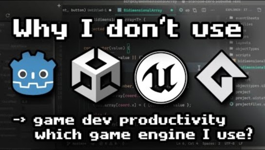
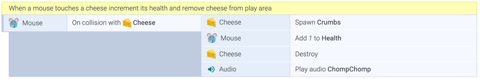

<!-- _class: main -->

# Web Games
## Week 3: Introduction to Construct

<!--
Welcome to week 3
-->

---

# Objectives

- Introduce Construct
- Build first game to explore plugins and behaviours
- Extend knowledge with game extension challenges

<!--
In today's session we will get started with Construct
-->

---

<!-- _class: lead -->

# 1. Construct 

---

# What is Construct

- Web based game engine
- Founded in 2011 by Scirra Games
- Over 100,000 monthly users
- Used by EA, Sega, King and many indie developers
- Over 50% of games on Kongregate are made in Construct

<!--

-->

---

# What can it do?

- Visual script editor = no coding
- Games created using 'events' and 'behaviours'
- In built sprite editor and animation timeline
- Numerous plugins to extend functionality
  - Gamepad, multipplayer, monetisation, leaderboards & more
- Can publish to Web, iOS, Android, Mac, Windows, Xbox...

<!--

-->

---

# Games made with construct

- [The Next Penelope](https://www.youtube.com/watch?v=LmT1N07oO7Q)
- [Mighty Goose](https://www.youtube.com/watch?v=NSIkiqGZa8M)
- [Guinea Pig Parkour](https://www.youtube.com/watch?v=Kj6Ik7cbLJ0)
- [Blitz Breaker](https://www.youtube.com/watch?v=502lM3N4dZE)
- [Football Dash](https://play.google.com/store/apps/details?id=com.beastattack.c1434846484727&hl=en_GB&pli=1)
- [& many more...](https://www.construct.net/en/make-games/showcase)

<!--
Further Reading: 

Super Ubie Island Dev Log: https://www.construct.net/en/forum/construct-3/your-construct-creations-9/super-ubie-island-devlog-125518

https://twitter.com/ConstructTeam/status/1740739704008368346

-->

---

# Why use Construct?

<!-- 
Good video explaining reasons for using Construct
-->
---

# Construct Events

Construct uses a visual coding system that allows you to build your games using event blocks. These events are formed by conditions on the left, which when met trigger actions on the right. These events can also be combined with custom javascript giving you greater control.

<!-- 
Events Overview

- Events are the building blocks of construct code and allow us to create conditions which when met trigger actions. 

- Conditions can be combined together, meaning multiple conditions need to be met for actions to occur. Think of this link an AND condition in standard programming. These can also be switched to OR blocks

- The events run top to bottom. As soon as one ends the next one triggers.

- Events run every ‘tick’ - usually 60 times per second.

- We can creating looping conditions if we want an event to trigger more than one per tick (e.g loop through and update all enemies on screen).

-->
---

# Construct Plugins

- Objects that can be added to a game
- Range from Sprites to Input (e.g. keyboard)
- Can access official and third party plugins
- Must add a plugin to a project to access functionailty

<!-- 
Further Reading: https://www.construct.net/en/make-games/manuals/construct-3/project-primitives/objects/plugins
-->
---

# Construct Behaviours

- Add extra functionality to objects
- Different plugins can have different behaviours
- Using behaviours save time
- Behaviours have customisable properties

<!-- 
Further Reading: https://www.construct.net/en/make-games/manuals/construct-3/project-primitives/objects/plugins
-->

---

# Construct Overview

Lets take a look at Construct, where you can find documentation, examples and accessing the editor. 

Head over to [editor.construct.net](https://editor.construct.net) and sign-in with your username

<!-- 
Overview the following

- Documentation
- Examples
- Layout
- Event Sheet
- Save
- Export
-->

---
<!-- _class: lead -->
# 2. Zombie Zap

<!--
The best way to start learning construct and seeing what plugins and behaviours we can use is by jumping in. So let’s start making a game…
-->
---

# Zombie Zap - Aims

Today’s game demo will consist of creating a simple shooting game where you need to survive against swarms of zombies for as long as possible. The game will consists of the following features:

- 8 direction movement on keyboard input
- Shooting based on mouse input
- Randomly spawning enemies
- Collision detection
- Instance variables
- Scoring mechanism

---

# Zombie Zap - Guide

A step by step guide can be found on Ultra for this simple shooting game. I will live demo these steps but you may wish to follow along with the guide as reference, or to refer back to later on.

The guide can be found under the Week 3 Materials.

<!--
You can find a follow along guide on Ultra. I'll be live demo'ing the steps and sharing my screen via collaborate
-->
---

# Input in Construct

- To handle input you need to add input objects your project
- The keyboard object is used to handle keyboard inputs
- Mouse / Touch used to handle click or touch events
- Remember to consider alternative inputs for mobile

<!--
Read more: 
https://www.construct.net/en/make-games/manuals/construct-3/plugin-reference/keyboard

https://www.construct.net/en/make-games/manuals/construct-3/plugin-reference/mouse

-->
---

<!-- _class: break -->

# Break

---

# Text in Construct

- The text object is used to display text in your games
- There are a limited number of built in fonts
- You have the ability to load in your own fonts
  - Range of formats accepted: ttf, otf, eot, woff, woff2
  - woff or woff2 recommended - https://www.font-converter.net/
  - Google fonts, Da Font, Font Squirrel good sources for finding fonts
- Don’t confuse the text object with Text Input

<!--
Read more: 
https://www.construct.net/en/blogs/construct-official-blog-1/integrated-web-fonts-construct-870

https://www.construct.net/en/make-games/manuals/construct-3/plugin-reference/text

[USE AS OPPORTUNITY TO DEMO DIFFERENT LAYOUTS]
-->
---

# Audio in Construct

- The audio object is used to play audio in your games
- Two categories for audio within a Construct project
  - Sounds - downloaded before playing
  - Music - streamed directly from the server
- Avoid placing large soundtracks in the Sounds folder
- Sounds can be preloaded
  - Longer load time vs potential delay first time sound is played
- On mobile user has to touch the screen before any audio plays

<!--
Read more: 
https://www.construct.net/en/make-games/manuals/construct-3/plugin-reference/audio

[USE AS OPPORTUNITY TO DEMO ADDING MUSIC AND SFX]
-->
---

# Extension Challenges

Use the remainder of the session to extend your exploration and learning of Construct and enhance zombie zap. Here are some suggested adaptations:

- Increase difficulty over time (e.g. new enemies, or faster enemies)
- Increase score for killing zombies as well as hitting them
- Add different weapon types
- Add powerups (e.g health drops) or obstacles (e.g. mines) to the level design
- Include different screen states (e.g. menu, play, game over).

---

# Task for next week

Continue exploring Construct and extending your learning. Make use of the game extension challenges to do so, or check out the example projects on Construct and see if you can extend or emulate these.

---

<!-- _class: main -->

# Up Next...
## Game Demo - Endless Runner

<a style="text-decoration: underline; position: absolute; bottom: 40px; font-size: 20px; color: #272838;" href="https://www.flaticon.com" target="_blank" title="cloud service icons">Icons sourced from Flaticon</a>

<!--
Next week we continue exploring Construct with another game demo
-->