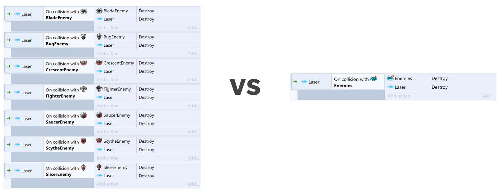

<!-- _class: main -->

# Web Games

## Week 8 - Mobile Controls & Object Families

<!--
Welcome to week 8
-->

---

# Objectives

- Learn how to implement mobile controls
- Streamline events with ‘families’
- Work on playable prototype projects

<!--
In today's session we will...
-->

---

<!-- _class: lead -->

# 1. Mobile Controls

---

# Mobile Controls

- Web games can be accessed on (almost)  any browser
- Consider how mobile players can play your game
- Platform Info object can check which platform user is on
- Browser object can check device orientation

<!-- 
[DEMO]
-->
---

<!-- _class: lead -->

# 2. Object Families

---

# Object Families

- Groups of object types
- Objects must be from the same plugin (e.g. all sprites)
- Families help avoid repeating events
- Objects in families can share behaviours and instance variables
- Can still have conditions that affect single object types within a family

<!--
Documentation: https://www.construct.net/en/make-games/manuals/construct-3/project-primitives/objects/families

-->

---

 

<!--
This image demonstrates the difference families can make to your events

[DEMO]
-->
---

# Related Concepts

- Containers
  - Can create ‘composite’ objects
  - Treats independent objects as if they were one
  - [Docs](https://www.construct.net/en/make-games/manuals/construct-3/project-primitives/objects/containers)
- Templates
  - Help with managing larger projects
  - Can use one object as a ‘base’ template to create replicas from
  - [Docs](https://www.construct.net/en/make-games/manuals/construct-3/project-primitives/objects/templates)

---
<!-- _class: break -->

# Break

---

# Project Development

Use the remainder of the session for project development and getting started on your playable prototypes.

---

<!-- _class: main -->

# Up Next...

## Saving and Loading

<a style="text-decoration: underline; position: absolute; bottom: 40px; font-size: 20px; color: #272838;" href="https://www.flaticon.com" target="_blank" title="cloud service icons">Icons sourced from Flaticon</a>

<!--
Next week...
-->